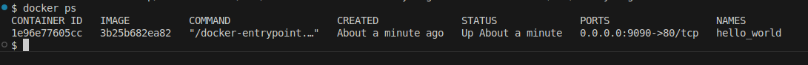

##

#### Чек-лист


## Задание 1

2. допустимо сохранить в ```personal.auto.tfvars```

```sh
# own secret vars store.
personal.auto.tfvars
```
3. ключ и значение random_password,  если я правильно понимаю вопрос, то это все, что относится к ```"sensitive_attributes"``` , т.е. значения (```"value"```) ```"bcrypt_hash"``` и ```"result"```

```
"bcrypt_hash": "$2a$10$Mr0eYhwzQNzHEOXK4UC1MO7J2X.R402WrE9mZCjnLKyPST7YIraEu",
"result": "VxH8u1p5KDbVVToe"
```

4. 

4.1 

```sh
| Error: Missing name for resource
│ 
│   on main.tf line 24, in resource "docker_image":
│   24: resource "docker_image" {
│ 
│ All resource blocks must have 2 labels (type, name).
```
ресурс должен содержать две метки тип и имя ```resource "docker_image" "nginx" { ... } ```

4.2

```sh
│ Error: Invalid resource name
│ 
│   on main.tf line 29, in resource "docker_container" "1nginx":
│   29: resource "docker_container" "1nginx" {
│ 
│ A name must start with a letter or underscore and may contain only letters, digits, underscores, and dashes.
```
имя ресурса не должно начинаться с цифры, да и должно начинаться с буквы или подчеркивания, а пусть будет таким ```"my_nginx"```

```resource "docker_container" "my_nginx" {...}```

4.3

```sh
│ Error: Reference to undeclared resource
│ 
│   on main.tf line 31, in resource "docker_container" "nginx":
│   31:   name  = "example_${random_password.random_string_FAKE.resulT}"
│ 
│ A managed resource "random_password" "random_string_FAKE" has not been declared in the root module.
```
ресур у нас ```random_password.random_string``` и ключ с значение регистрозависим, значит ```result```

```sh
name  = "example_${random_password.random_string.result}"
```

4.0

```sh
│ Error: Unsupported Terraform Core version
│ 
│   on main.tf line 8, in terraform:
│    8:   required_version = "~>1.8.4" /*Многострочный комментарий.
│ 
│ This configuration does not support Terraform version 1.9.8. To proceed, either choose another supported Terraform version or update this version constraint. Version constraints are
│ normally set for good reason, so updating the constraint may lead to other errors or unexpected behavior.
╵
```

```bash
$ terraform --version
Terraform v1.9.8
on linux_amd64
```
тут не попали в минорную версию, а в условии проверки версии указано использовать только 1.8 с патч-версией от 4 и выше

заменил на ```required_version = ">=1.8.4"```

**результат**

```sh
$ terraform validate
Success! The configuration is valid.
```

5.


6.

```name = "hello_world"```



```-auto-approve``` с одной стороны уменьшает уровень проверки, что может привести к запуску кода с инфраструктурными ошибками и как результат мы получим развернутую инфраструктуру не отвечающую нашим требованиям. С другой стороны позволяет автоматизировать процесс развертывания.

7.

terraform.tfstate
```
{
  "version": 4,
  "terraform_version": "1.9.8",
  "serial": 11,
  "lineage": "e61bb26f-edde-447f-9e0a-a8385acca800",
  "outputs": {},
  "resources": [],
  "check_results": null
}
```

8.


```
resource "docker_image" "nginx"{
    ...
    keep_locally = true
}
```

из документации:

```keep_locally``` (Boolean) If true, then the Docker image won't be deleted on destroy operation. If this is false, it will delete the image from the docker local storage on destroy operation.